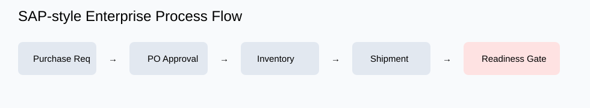
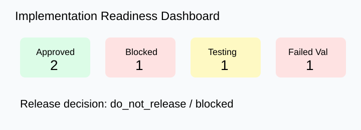
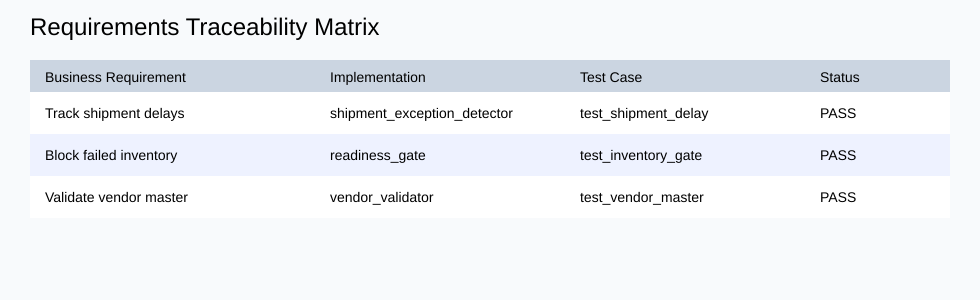
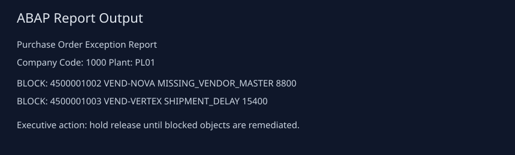
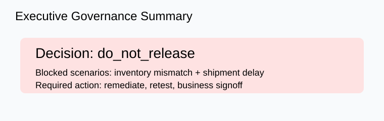

# Enterprise Process Lab

[](https://github.com/kritibehl/enterprise-process-lab/actions/workflows/ci.yml)

Enterprise Process Lab is an enterprise applications and business-systems engineering project that simulates ERP-style implementation workflows across supply chain, requirements traceability, readiness governance, process analytics, and change management.


## Role-Based Access and Controls Compliance

The repo includes a controls-compliance layer for SAP-style procurement and ERP integration workflows:

    controls_compliance/

It models:

- Role access matrix
- Segregation-of-duties rules
- Approval policy
- Audit log samples
- Release-blocking controls governance

Example controls decision:

    {
      "sod_violations": 2,
      "failed_audit_events": 1,
      "release_decision": "block_release"
    }

This demonstrates that controls compliance can be enforced, monitored, and tied directly to go-live readiness decisions.


## Public Dashboard

The repo includes a static public dashboard:

    public_dashboard/index.html

Dashboard metrics:

- Readiness Score: 84
- Approved: 7
- Blocked: 3
- Review: 2
- Executive Decision: DO_NOT_RELEASE

It also visualizes one enterprise integration scenario:

    SAP Purchase Order → Oracle Finance → ServiceNow Change Ticket → Workday Approval

Example output:

    {
      "business_object": "Purchase Order",
      "status": "approved",
      "integrations_validated": 4
    }


## Visual Walkthrough

### SAP-Style Process Flow



### Implementation Readiness Dashboard



### Requirements Traceability Matrix



### ABAP Report Output



### Executive Governance Summary




## Core Capabilities

- Supply Chain Workflow Explorer
- Requirements Traceability Matrix
- Implementation Readiness Dashboard
- Process Analytics
- Change Management Center

## Example Readiness Output

```json
{
  "approved": 2,
  "blocked": 1,
  "in_testing": 1,
  "failed_validation": 1,
  "release_decision": "blocked"
}
Example Process Analytics
{
  "cycle_time_days_avg": 3.88,
  "exception_rate": 0.4,
  "throughput": 5,
  "sla_adherence": 0.6
}
Run Locally
python3 -m venv .venv
source .venv/bin/activate
pip install -r requirements.txt

PYTHONPATH=. pytest -q
python3 -m enterprise_process_lab.run
Repository Structure
enterprise_process_lab/
  core.py
  run.py

tests/
  test_enterprise_process_lab.py

artifacts/
  workflow_explorer.json
  requirements_traceability_matrix.json
  implementation_readiness_dashboard.json
  process_analytics.json
  change_management_center.json
  enterprise_process_report.md

docs/
  architecture.md
  implementation_playbook.md
Safe Resume Bullet

Built Enterprise Process Lab, an ERP-style operations platform simulating supply-chain workflows, requirements traceability, implementation readiness, process analytics, and change-management governance across enterprise application lifecycles.

Target Role Families
Enterprise Applications Engineer
Business Systems Engineer
SAP Application Engineer
Oracle Applications Engineer
Workday Integration Engineer
Salesforce Platform Engineer
ServiceNow Platform Engineer
Implementation Consultant
